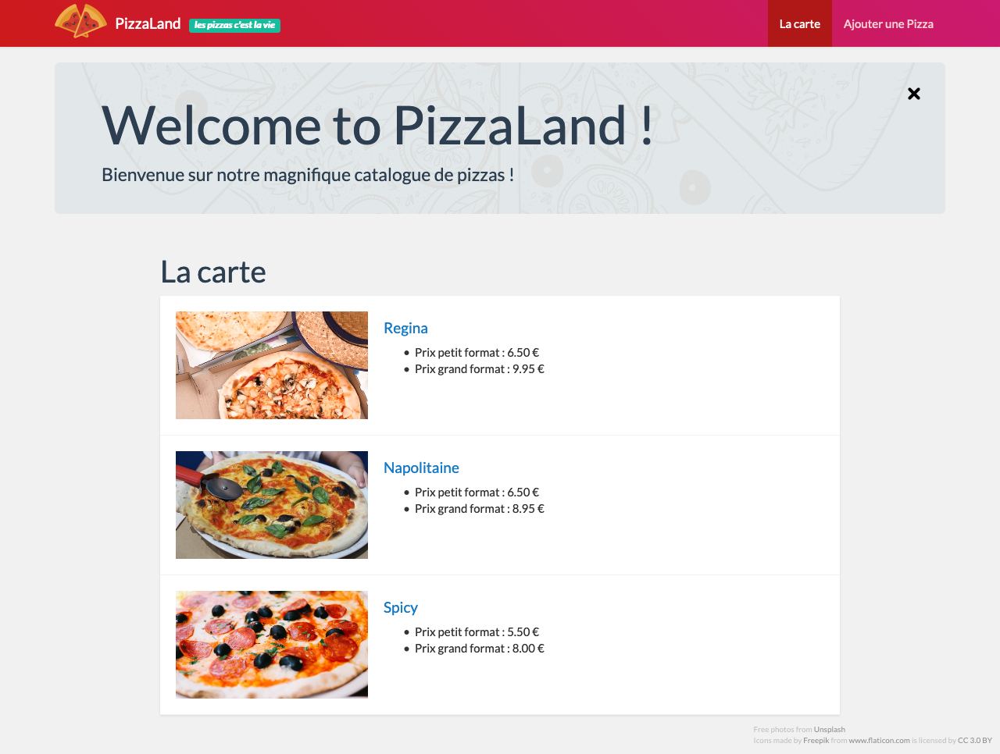
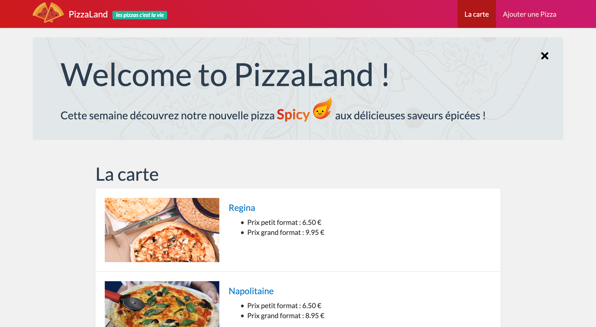

#### TP4 - AJAX - jQuery <!-- omit in toc -->
# A. AJAX <!-- omit in toc -->

## Sommaire <!-- omit in toc -->
- [A.1. Installation](#a1-installation)
- [A.1. Configuration du projet](#a1-configuration-du-projet)
- [A.2. XMLHttpRequest vs fetch](#a2-xmlhttprequest-vs-fetch)
- [A.3. Charger un fichier statique](#a3-charger-un-fichier-statique)
- [A.4. Appeler une API REST/JSON en GET](#a4-appeler-une-api-restjson-en-get)
- [Étape suivante](#Étape-suivante)

***Ce TP va permettre de connecter notre appli JS à une base de données distante par l'intermédiaire d'une API REST/JSON mettre en oeuvre les principales méthodes de sélection et de modification d'éléments de l'arbre DOM.***

## A.1. Installation
## A.1. Configuration du projet

**Ce repo contient une solution commentée du précédent TP. Il servira de base au T3 :**

1. Clonez le projet
	```bash
	mkdir -p ~/ws-js/tp4
	git clone https://gitlab.univ-lille.fr/js/tp4.git ~/ws-js/tp4
	```
2. Lancez VSCodium :
	```bash
	codium ~/ws-js/tp4
	```
3. Ouvrez un terminal intégré dans VSCodium à l'aide du raccourci <kbd>CTRL</kbd>+<kbd>J</kbd> et tapez :
	```bash
	npm install
	```
4. **Une fois tout installé, vous pouvez relancer la compilation à l'aide de la commande `npm run watch` et lancer le serveur http avec `npx serve -l 8000`**. Vérifiez ensuite que la page s'affiche correctement dans le navigateur :<br><a href="images/readme/pizzaland-apidom-fin.png"></a>

## A.2. XMLHttpRequest vs fetch
Comme vu en cours (*récupérez si ce n'est pas déjà fait le pdf sur moodle !*) il existe deux méthodes pour charger/envoyer des données en JS : [XMLHttpRequest](https://developer.mozilla.org/en-US/docs/Web/API/XMLHttpRequest) et l'[API fetch](https://developer.mozilla.org/en-US/docs/Web/API/Fetch_API/Using_Fetch)

**C'est l'API fetch que nous utiliserons dans ce TP.**
<br>En effet, elle dispose d'une syntaxe plus concise, avec laquelle il est plus facile de chaîner les traitements grâce aux [Promises](https://developer.mozilla.org/fr/docs/Web/JavaScript/Guide/Utiliser_les_promesses).

Pour rappel, le support navigateur de l'API fetch est plutôt bon, mais il reste encore plusieurs points problématiques :

<a href="http://caniuse.com/#feat=fetch">
	<picture>
		<source type="image/webp" srcset="https://caniuse.bitsofco.de/image/fetch.webp">
		
	</picture>
</a>

Comme on peut le voir, **aucune version d'Internet Explorer n'est compatible avec l'API fetch**. C'est aussi le cas des versions d'android 4.4.4 et inférieures. Heureusement, un [polyfill](https://fr.wikipedia.org/wiki/Polyfill) développé par Github est disponible ici : https://github.com/github/fetch. Sur un projet réel il faudrait mettre en place ce polyfill, mais pour gagner du temps nous ignorerons cette problématique dans le TP (ne faites pas ça dans la vraie vie !).


## A.3. Charger un fichier statique
**Avant de connecter notre application au serveur REST/JSON, nos allons nous entraîner sur un fichier statique.**

1. **Créez un fichier `news.html` à la racine (au même niveau que le `index.html`) avec le code html suivant** :
	```html
	<article class="jumbotron">
		<button class="closeButton"></button>
		<h1>Welcome to PizzaLand !</h1>
		<p>
			Cette semaine découvrez notre nouvelle pizza
			<strong class="spicy">
				Spicy
				
			</strong>
			aux délicieuses saveurs épicées !
		</p>
	</article>
	```
1. **Dans le fichier main.js, à la fin du code, lancez le chargement du fichier `news.html` avec l'API fetch** :
	```js
	fetch('./news.html');
	```

	Rechargez la page html dans le navigateur et vérifiez dans l'onglet Network/Réseau des devtools que votre page lance bien le chargement du fichier `news.html` :

	<a href="images/readme/ajax-news-html-network.jpg"></a>

	Notez qu'il s'agit bien d'une requête HTTP et pas d'un appel à un fichier local : l'URL de la requête est bien http://localhost:8000/news.html c'est donc bien le serveur HTTP (lancé par Python si vous utilisez les ordis des salles TP) qui génère la réponse HTTP retournée au navigateur.

	Maintenant que l'on arrive à charger le fichier, reste à exploiter les données qu'il contient !
3. **Commencez par inspecter la réponse retournée par `fetch()` grâce à la méthode `.then()`** :
	```js
	fetch('./news.html')
		.then( response => console.log(response) );
	```

	Rechargez la page et regardez ce qui s'affiche dans la console : il s'agit d'un objet de type [Response](https://developer.mozilla.org/en-US/docs/Web/API/Response) retourné par l'API fetch.

	Comme vu en cours, cet objet contient notamment des propriétés `ok`, `status` et `statusText` qui permettent d'en savoir plus sur la réponse HTTP retournée par le serveur.

4. **On va maintenant pouvoir récupérer les données brutes contenues dans la réponse HTTP grâce à la méthode [response.text()](https://developer.mozilla.org/en-US/docs/Web/API/Body/text)** :
	```js
	fetch('./news.html')
	  .then( response => response.text() )
	  .then( responseText => console.log(responseText) );
	```
	Vérifiez que la console affiche bien le contenu HTML du fichier `news.html` :

	<a href="images/readme/ajax-news-html-console.jpg"></a>

	*Maintenant que l'on est capable de récupérer le contenu du fichier `news.html` sous forme de chaîne de caractères, il ne reste plus qu'à **l'injecter dans la page HTML** !*

5. **Pour bien comprendre l'ordre d'exécution ajoutons des instructions `console.log()` dans le code précédent comme suit** :
	```js
	console.log(1);
	fetch('./news.html')
	  .then( response => response.text() )
	  .then( responseText => console.log(responseText) );
	console.log(2);
	```
    Regardez dans quel ordre s'affichent les log dans la console :
	<a href="images/readme/ajax-news-html-console2.jpg"></a>

	Est-ce que cela vous semble normal ? Non ? C'est pourtant logique : la fonction qui est passée au deuxième `.then()` n'est exécutée qu'une fois que la requête http est terminée (càd. une fois que le fichier est fini de télécharger). Le reste du code continue de s'exécuter en attendant que la requête se termine !

	Si vous avez compris, vous pouvez effacer les `console.log` inutiles et passer à la suite. Sinon appelez le professeur !

6. Avant d'injecter le code html dans la page, vous allez devoir faire un peu de ménage  :
	- dans le fichier `index.html`, supprimez le contenu de la balise `<section class="newsContainer">...</section>`.
	- Puisque l'on a supprimé le bouton `closeButton` de la page html, le code JS qui détectait le clic dessus ne peut plus fonctionner. Commentez-le, on en aura besoin plus tard.

7. **À l'aide de l'API DOM injectez le contenu du fichier `news.html` dans la section de classe `newsContainer`**. Plutôt que de tout coder dans le `.then()` on va passer par une nouvelle fonction `displayNews`:
	```js
	function displayNews(html) {
	    const newsContainer = document.querySelector('.newsContainer');
	    if (newsContainer) {
	        newsContainer.innerHTML = html;
	    }
	}
    fetch('./news.html')
	    .then( response => response.text() )
	    .then( displayNews );
	```

	Le résultat obtenu doit être ceci :

	<a href="images/readme/ajax-news-innerhtml.png"></a>

8. Faites en sorte que le clic sur le `closeButton` fonctionne à nouveau

## A.4. Appeler une API REST/JSON en GET
**Maintenant que l'on est capables de récupérer une ressource externe en JS et d'en afficher le contenu, connectons notre application au serveur REST développé en cours de programmation répartie !!!**

1. **Téléchargez le serveur REST/JSON sur https://framadrop.org/r/qSK5FNKrYJ#/8DXgX6YRX2QxX5BI52XtZVt/353Mtx2pf7bnZGjN3Y=
2. **Lancez le serveur dans un terminal** :
	```bash
	java -jar pizzaland-jar-with-dependencies.jar
	```
3. **Vérifiez que le serveur fonctionne correctement en ouvrant dans votre navigateur la page http://localhost:8080/api/v1/pizzas**

	<a href="images/readme/pizzaland-server-get-pizzas.jpg"></a>

4. Dans le fichier `main.js` commencez par :
	- remplacez la ligne 10
		```js
		const homePage = new HomePage(data);
		```
		par
		```js
		const homePage = new HomePage([]);
		```
	- puis **supprimer** les lignes suivantes :
	- ligne 1 :
		```js
		import data from './data.js';
		```
	- ligne 11 :
		```js
		PageRenderer.renderPage(homePage); // affiche la liste des pizzas
		```
5. Toujours dans le fichier `main.js`, à la fin du fichier, lancez un appel AJAX vers l'URL http://localhost:8080/api/v1/pizzas. Puis, en vous inspirant de ce qui a été fait pour les news, créez une fonction `renderHome()` qui :
	- est appelée lorsque l'appel AJAX est terminé
	- qui n'a qu'un seul paramètre nommé `data` (facultatif) qui correspond au tableau des pizzas retourné par l'API
	- qui envoie le tableau de pizzas à la `homePage` et qui l'affiche grâce à la classe `PageRenderer` :
		```js
		if (data) {
			homePage.pizzas = data;
		}
		PageRenderer.renderPage(homePage);
		```

	Ca y est ! La page s'affiche maintenant avec la liste complète des pizzas contenues dans la base de données du serveur REST !! :metal: :tada: :trophy: :pizza: :beers:

	<a href="images/readme/ajax-get-pizzas-innerhtml.gif"></a>


## Étape suivante
Maintenant que l'on est capable de faire communiquer notre appli JS avec un serveur distant, nous allons voir dans le prochain exercice comment simplifier notre code à l'aide de jQuery : [B. jQuery](./B-jquery.md).)